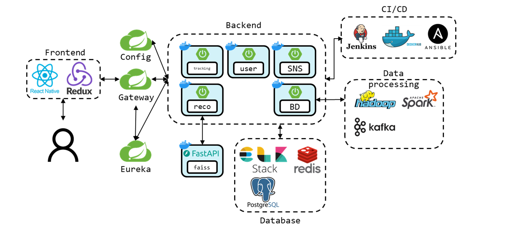
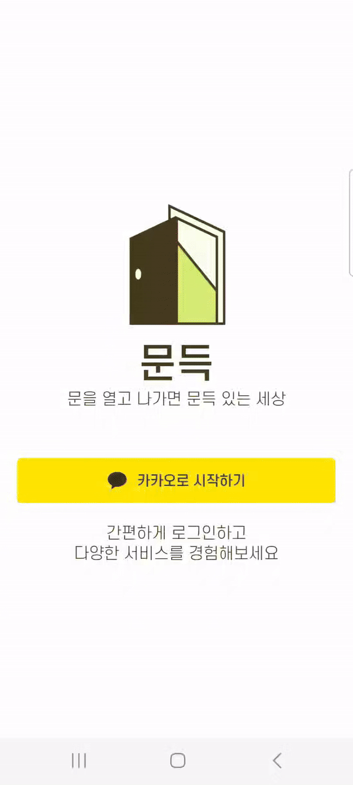

# 문득
> **산책 안에서 소소한 위로, 작은 행복, 긍정적 감정을 발견해 건강한 삶을 되찾자**

# 목차
1. [프로젝트 소개](#1-프로젝트-소개)
2. [서비스 소개](#2-서비스-소개)
3. [팀원 소개](#3-팀원-소개)
4. [개발 환경](#4-개발-환경)
5. [기술 소개](#5-기술-소개)
6. [회고](#6-회고)

# 1. 프로젝트 소개
### 배경  

### 개요

### Repository
|도메인|링크|
|:--|:--|
|화면|[FE](https://github.com/)|
|회원|[BE-USER](https://github.com/mundeug/Back-User)|
|SNS|[BE-SNS](https://github.com/mundeug/Back-SNS)|
|산책로|[BE-TRACKING](https://github.com/mundeug/Back-Tracking)|
|클라우드|[BE-CLOUD](https://github.com/mundeug/Back-Cloud)|
|빅데이터|[BE-BIGDATA](https://github.com/mundeug/Back-BigData)|

### 시스템 아키텍처

# 2. 서비스 소개
> **회원 로그인**

  

> **산책 시작**

> **산책 도중 24시간이 지나면 사라지는 핀 생성**

> **산책로 저장**

  

> **산책로 추천**

  

> **두드림길 (서울시 185개 공식 산책로)**

  

> **내 메인 피드화면**

  

# 3. 팀원 소개
|  |  |  |  |  |  |
|:---:|:---:|:---:|:---:|:---:|:---:|
| [홍윤기](https://github.com/Yg-Hong) | [김현종](https://github.com/hyeonjong-kim) | [노성은](https://github.com/seroh00) | [박기련](https://github.com/parkgr95) | [이수민](https://github.com/waterlee6) | [최민준](https://github.com/hitobi1014) |
| FE, 팀장 | Infra, BE | FE | BE | FE | BE |

<!--  -->
# 4. 개발 환경
### ⚙ Infra

<!--  -->
### 🎨 Front-End

### 🖥 Back-End
<!--  -->

### 💾 DB

### ⚒ Tools

# 5. 기술 소개
### Infra
### Front-End
### Back-End
- Cloud
- User
- SNS
- Tracking
- BigData

# 6. 회고
- **홍윤기**
- **김현종**
- **노성은**
- **박기련**  
  열정적이고 유능한 팀원들을 만나 MSA 패턴을 경험하고, 특히 haddop, kafka 등 빅데이터 프레임워크와 Jenkins 등의 인프라를 배울 수 있었다는 점이 프로젝트에서 얻을 수 있었던 가장 큰 수확이었습니다.
- **이수민**
- **최민준**  